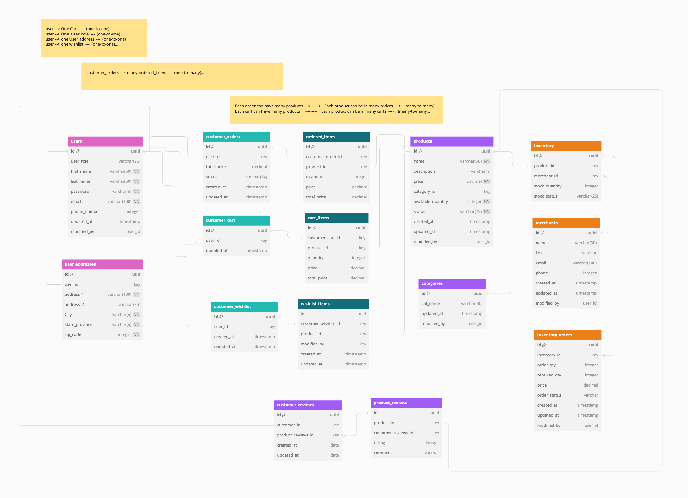
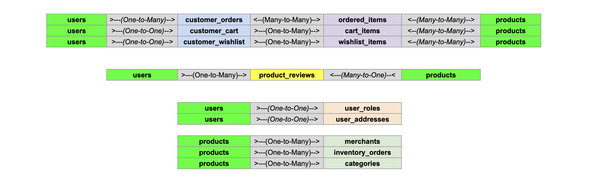

Chic Haven Boutique's database consists of 15 tables, with the "users" and "products" tables serving as the central entities. These two tables form the foundation of most relationships, allowing the system to track interactions and attributes associated with the remaining 13 tables. The "ordered_items," "cart_items," and "wishlist_items" tables act as junctions, facilitating many-to-many relationships between the central entities (users and products) and other related tables (customer_orders, customer_carts, and customer_wishlists). This design provides a comprehensive way to manage and query the boutique's data, ensuring information is accessible to both site administrators and customers.

## Schema and Relationship Logic





Trello Board: [here](https://docs.google.com/spreadsheets/d/12P3g-iGvFKMqc1FE_yd0Fw41fo_1pcaz2AfFbJcMvvQ/edit?usp=sharing)

User Story and Logic [here](https://docs.google.com/spreadsheets/d/12P3g-iGvFKMqc1FE_yd0Fw41fo_1pcaz2AfFbJcMvvQ/edit?usp=sharing)

## Local Setup & Enviornment Variables

-- Create PostgreSQL database : chic_haven

-- Install dependencies: pg, express, nodemon, bcrypt, uuid, jsonwebtoken, dotenv

-- Start Server: from root folder

```
npm run start:dev
```
