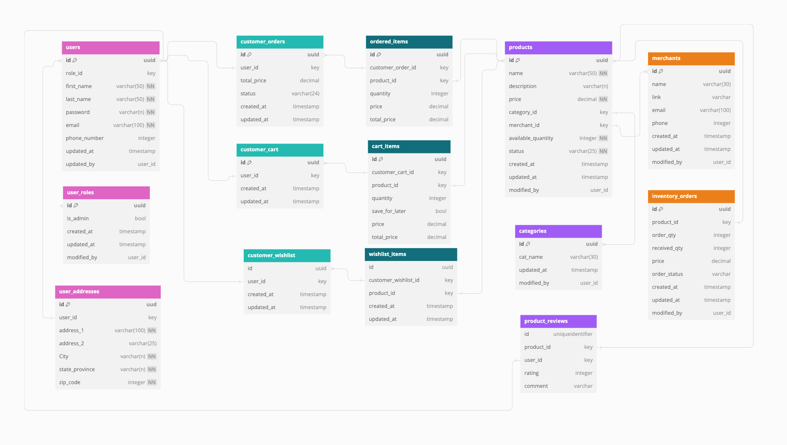
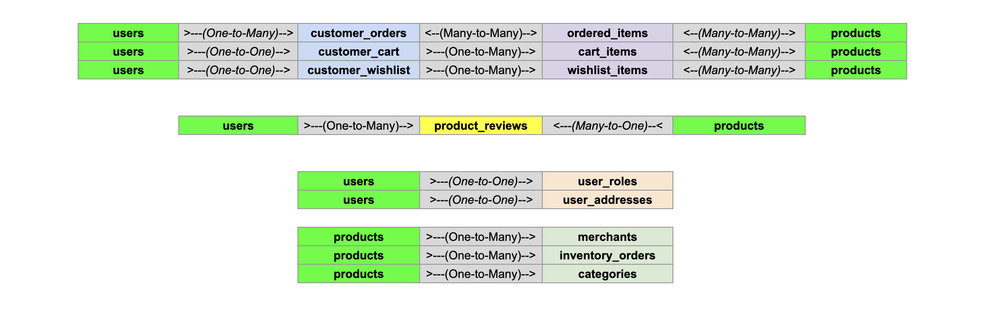

## Chic Haven Boutique Database

Chic Haven Boutique's database consists of 14 tables, with the "users" and "products" tables serving as the central entities. These two tables form the foundation of most relationships, allowing the system to track interactions and attributes associated with the remaining 12 tables. The "ordered_items," "cart_items," and "wishlist_items" tables act as junctions, facilitating many-to-many relationships between the central entities (users and products) and other related tables (customer_orders, customer_carts, and customer_wishlists). This design provides a comprehensive way to manage and query the boutique's data, ensuring information is accessible to both site administrators and customers.

## Schema and Relationship Logic

